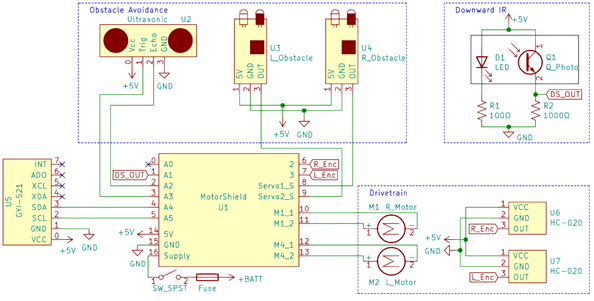
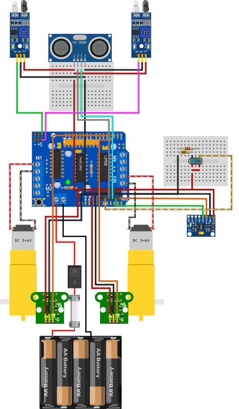
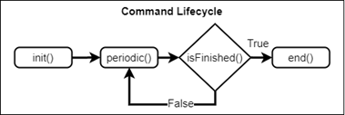
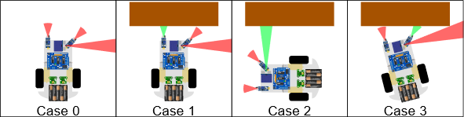
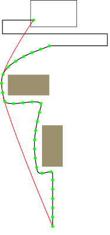

# Navbot
This repository contains code for controlling an Arduino robot which drives around obstacles to a marker, then returns to the starting location.
# Hardware
The robot uses the common 2wd polycarbonate chassis with gearmotors and encoders. It is controlled by an Arduino Uno using an Adafruit Motor Sheild v1.

The robot uses the following sensors:
 - 2x IR Obstacle Sensors
 - 1x Ultrasonic Sensor
 - 2x HC-020k Encoders
 - 1x TCRT5000 IR Sensor
 - 1x GY-521 Gyro

## Schematic

## Image

# Software
## Command Framework
The robot is controlled using a command-based framework, roughly based on [FRC's WPILib](https://docs.wpilib.org/en/stable/docs/software/commandbased/what-is-command-based.html). In this framework, robot operations are broken into commands representing discrete steps, such as driving to a position or turning to a heading. Commands are queued at setup then run by a central scheduler, with the below lifecycle:

A single command can be run at any time as an interrupt, overriding the schedule until 
is has finished (this is used primarily for avoidance).

## Primary Navigation
The robot's primary navigation comes from odometry calculated using the gyroscope and encoders. This is then fed into a command which drives towards a target point by feeding the heading error into a PID controller. If obstacles are detected, the avoidance command is run as an interrupt. Once the target position has been reached, the robot searches in a zig-zag pattern to locate the floor marker. Finally, the robot computes a more efficient return path and drives along it to return to the starting location.

## Avoidance
Obstacles are avoided by turning left and driving alongside until they are no longer detected, then resuming course. The sensors are configured to detect the below cases for avoiding obstacles.

## Return Path
To calculate the return path, the robot leaves a trail of "breadcrumbs" as it navigates. The then robot uses a simplified version of the [Jarvis March](https://en.wikipedia.org/wiki/Gift_wrapping_algorithm), which finds the outer path around the point cloud, reducing the distance by cutting corners where possible.

# Dependencies
The following libraries are required to build and deploy:
 - [Adafruit Motor Shield v1](https://github.com/adafruit/Adafruit_Motor-Shield-v1)
 - [PID_v2](https://github.com/gelraen/Arduino-PID-Library)
 - [mpu6050](https://github.com/electroniccats/mpu6050)